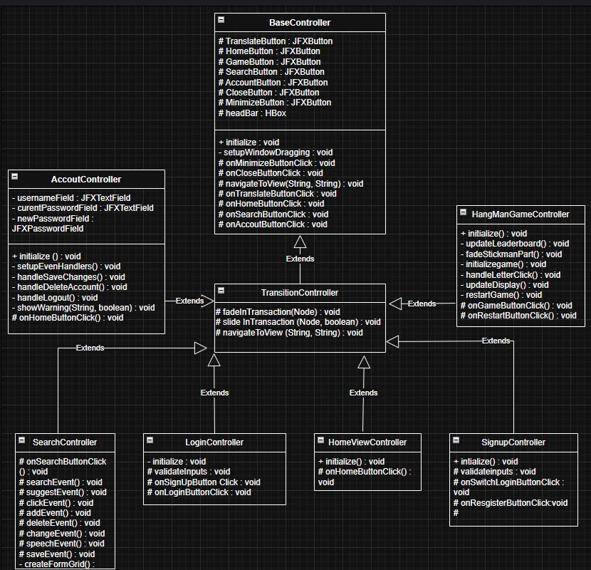
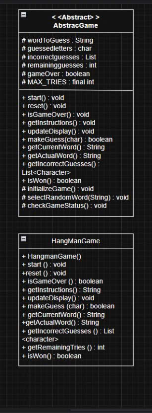
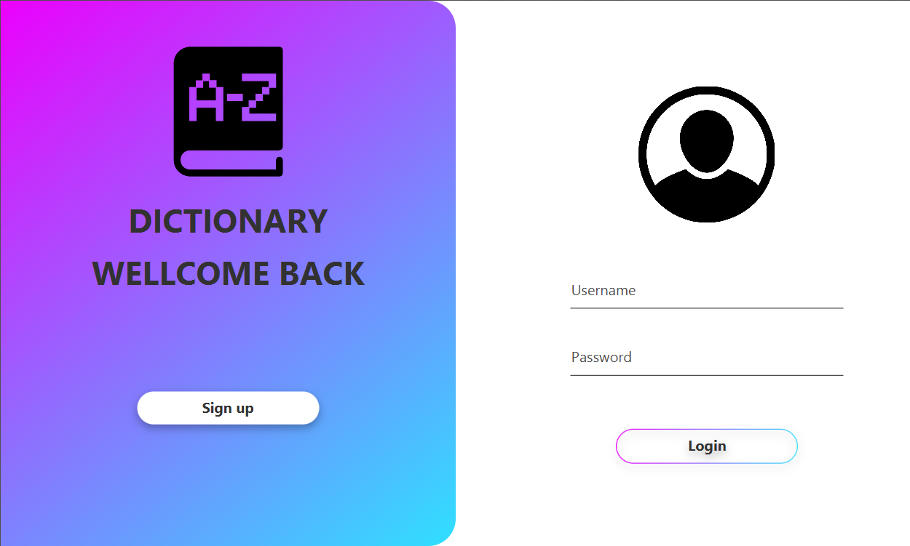
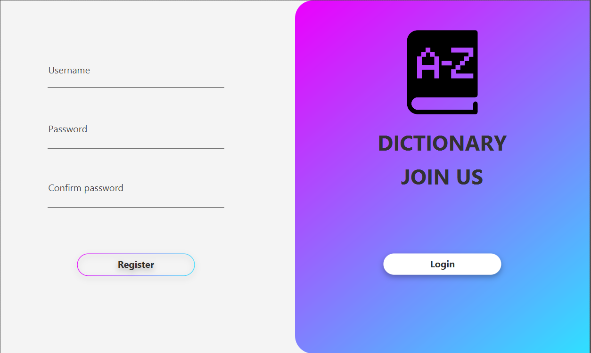
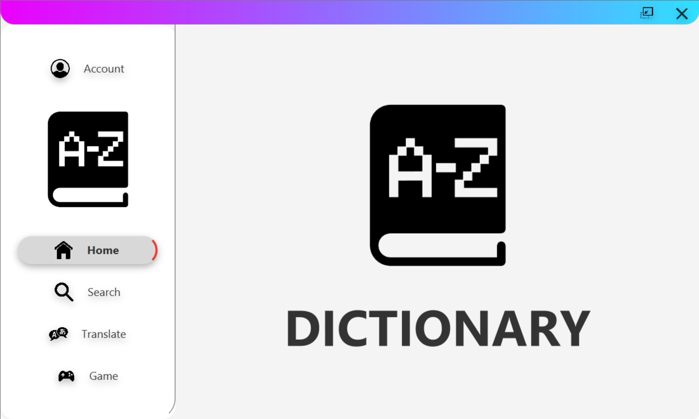
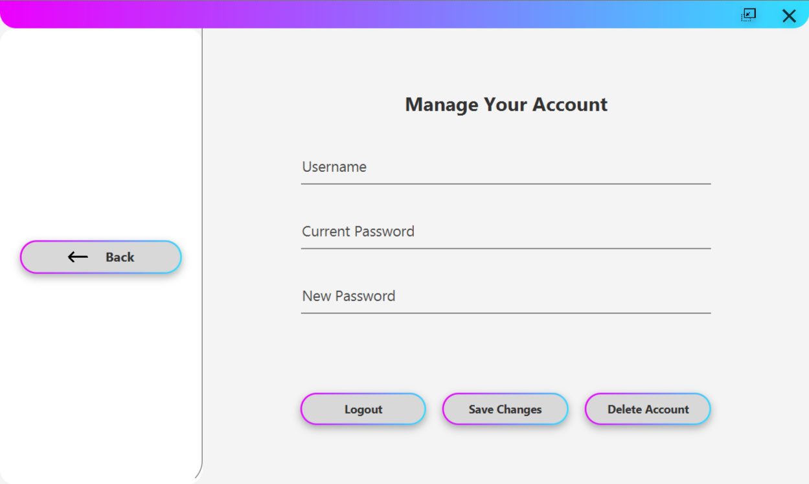
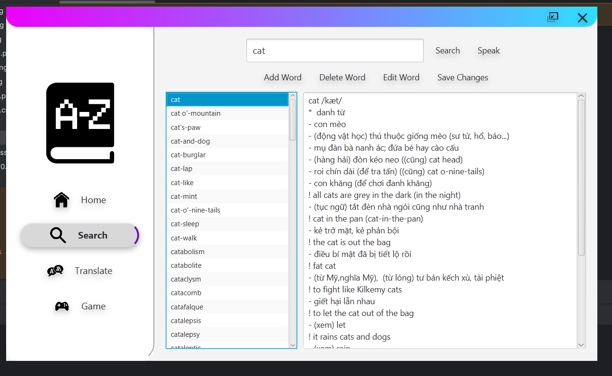
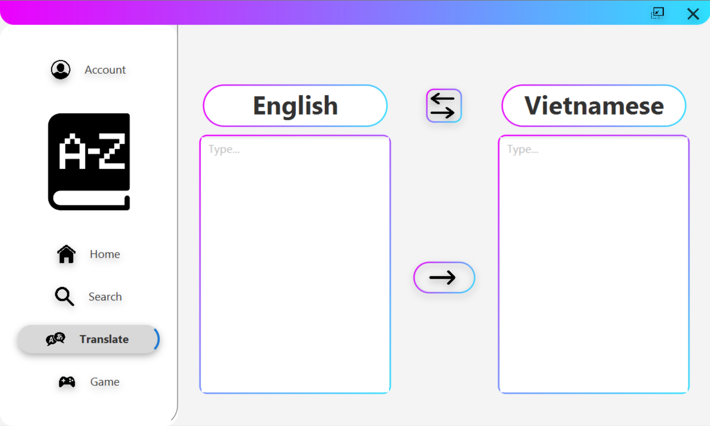
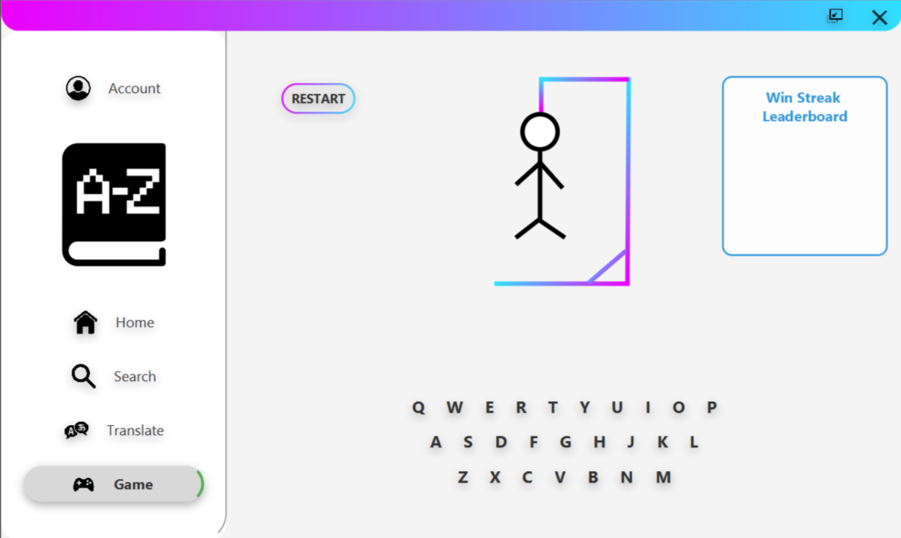

# Application to support learning English using Java

## Author
Group 1
1. Dinh Ich Minh Hoang - 24022335
2. Ngo Duc Duy - 24022311
3. Nguyen Sy Quyen - 24022437

## Description
The application is designed to support learning English. The application is written in Java and uses the JavaFX library. The application is based on the MVC model. The application has two types of dictionaries: English-Vietnamese and Vietnamese-English. The application use dtb.txt, user.txt and gameWords.txt files to store data.
1. The application is designed to support learning English.
2. The application is written in Java and uses the JavaFX library
3. The application is based on the MVC model
4. The application has two types of dictionaries: English-Vietnamese and Vietnamese-English.
5. The application use dtb.txt, gameWords.txt and user.txt files to store data.

## UML diagram

## Installation
1. Clone the project from the repository.
2. Open the project in the IDE.
3. Run the project.
4. If you want to change the data, you can change the user.txt, gameWords.txt and dtb.txt files.

## Usage
1. Select mode: English-Vietnamese or Vietnamese-English to choose the dictionary.
2. Search for a word in the dictionary and click the Search button, then the right side of the window will display the meaning of the word.
3. To add a new word, click the Add button (Plus icon).
4. To delete a word, click the Delete button (Minus icon).
5. To edit a word, click the Edit button (Pencil icon).
6. To save the changes, click the Save button (Disk icon).
7. To pronounce the word, click the Pronounce button (Speaker icon).
8. To play HangManGame, click the HangManGame button, then the application will display a Game window.
    + When you win, the screen will display the word 'Win'.When you win, the screen will display the word 'Win'.
    + When you lose, the screen will display the word 'Guess needed'.
    + + To replay HangManGame, click the replay button.
    +  + The right side is a table containing the longest winning streaks.
9. To exit the application, click the Exit button (Cross icon).

## Demo

## Future improvements
1. Add more dictionaries.
2. Add more complex games.
3. Optimize the word lookup algorithm.
4. Use a database to store data.
5. Integrate the application with API of Google Translate to translate paragraphs and whole documents.
6. Integrate the application with API of Google Speech to Text to convert speech to text.
7. Improve the user interface.

## Contributing
thanks to user Maksym on stackoverflow.com for helping us to complete the translation feature.

## Project status
The project is completed.

## Notes
The application is written for educational purposes.